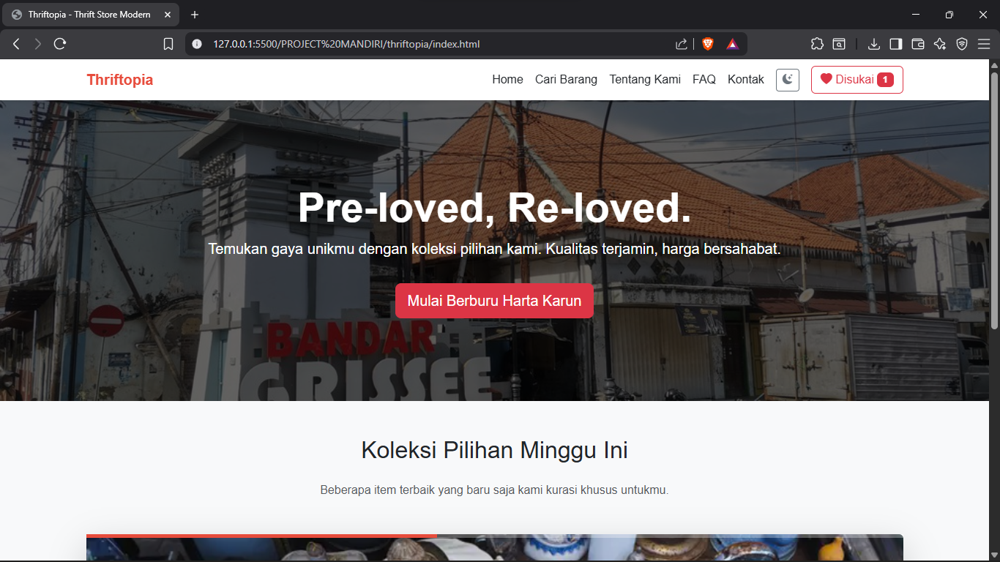

#  Thriftopia - Website E-Commerce Statis 🛍️

Sebuah website e-commerce statis bertema thrift store yang dibangun sebagai Proyek Mandiri Mata Kuliah Pemrograman Berbasis Platform - Universitas Negeri Surabaya.

[](https://NDORRRRR.github.io/thriftopia/)

---

## 📸 Tampilan


*Tampilan halaman utama dan Thriftopia di desktop.*

---

## 📄 Deskripsi Proyek

Thriftopia adalah sebuah prototipe website jual beli barang bekas (thrift store) yang modern dan responsif. Proyek ini dibuat untuk menerapkan konsep-konsep dasar pengembangan web front-end, mulai dari struktur HTML semantik, styling dengan CSS dan Framework Bootstrap, hingga interaktivitas dinamis menggunakan JavaScript. Website ini memiliki 5 halaman yang saling terhubung dan dilengkapi dengan berbagai fitur untuk menciptakan pengalaman pengguna yang menarik.

---

## ✨ Fitur Utama

- [x] **5 Halaman Statis**: Home, Produk, Tentang Kami, FAQ, dan Kontak.
- [x] **Render Produk Dinamis**: Data produk dikelola dalam array JavaScript, membuat penambahan atau perubahan produk menjadi lebih mudah.
- [x] **Filter Produk**: Memfilter produk berdasarkan kategori secara *real-time*.
- [x] **Pencarian Produk**: Mencari produk berdasarkan nama dengan input teks.
- [x] **Sistem 'Like'**: Pengguna dapat menyukai produk, dan pilihan mereka akan disimpan di `localStorage` sehingga tidak hilang saat halaman di-refresh.
- [x] **Notifikasi Kustom**: Menggunakan Modal Bootstrap untuk notifikasi pengiriman form yang lebih modern dan menyatu dengan desain.
- [x] **Desain Responsif**: Tampilan yang baik di berbagai ukuran layar (Desktop & Mobile) berkat Bootstrap 5 Grid System.
- [x] **Tombol Scroll to Top**: Memudahkan navigasi kembali ke atas halaman.
- [x] **Animasi Scroll (AOS)**: Efek animasi halus saat elemen masuk ke layar untuk pengalaman visual yang lebih menarik.

---

## 🛠️ Teknologi yang Digunakan

- **HTML5**
- **CSS3**
- **JavaScript (ES6)**
- **Bootstrap 5**
- **Bootstrap Icons**
- **Animate on Scroll (AOS) Library**
- **Google Fonts**

---

## 📁 Struktur Folder
thriftopia-project/
|
├── css/
│   └── style.css 
├── js/
│   ├── main.js
│   └── script.js
├── images/
│   └── (semua gambar produk)
│
├── index.html
├── produk.html
├── tentang.html
├── faq.html
├── kontak.html
└── README.md

---

## 🚀 Cara Menjalankan Proyek

1. Clone repository ini ke mesin lokal Anda:
   ```bash
   git clone [https://github.com/NAMA-USER-GITHUB/NAMA-REPO.git](https://github.com/NDORRRRR/thriftopia.git)

2. Masuk ke direktori proyek:
    cd thriftopia

3. Buka file index.html di local browser Anda.
